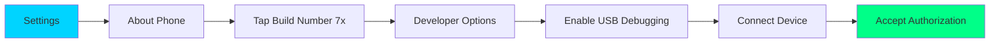
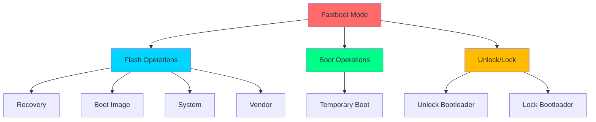

<div align="center">

<!-- Hero Banner -->


<br/>

<!-- Badges -->
<p align="center">
  <a href="https://github.com/0xb0rn3/droidB/releases">
    
  </a>
  <a href="https://github.com/0xb0rn3/droidB/blob/main/LICENSE">
    
  </a>
  <a href="https://github.com/0xb0rn3/droidB/stargazers">
    
  </a>
  <a href="https://github.com/0xb0rn3/droidB/network/members">
    
  </a>
</p>

<p align="center">
  <a href="https://github.com/0xb0rn3/droidB/issues">
    
  </a>
  <a href="https://www.shellcheck.net/">
    
  </a>
  <a href="#">
    
  </a>
</p>

<!-- Animated Tagline -->
<h3>
  
</h3>

<br/>

<!-- Quick Links -->
<p align="center">
  <a href="#-highlights">
    
  </a>
  <a href="#-quick-start">
    
  </a>
  <a href="#-debloater">
    
  </a>
  <a href="#-documentation">
    
  </a>
  <a href="#-support">
    
  </a>
</p>

<br/>

<!-- Description -->
<p align="center">
  <b>The Ultimate Swiss Army Knife for Android Devices</b><br/>
  <i>Debloat • Flash • Manage • Optimize • Automate</i>
</p>

</div>

---

<br/>

## ✨ Highlights

<table>
<tr>
<td width="50%" valign="top">

### 🗑️ **Universal Debloater**
```bash
300+ Bloatware Packages
├── One-Click Removal
├── Category Selection
├── Safe Restoration
└── Zero Root Required
```

**Remove unwanted apps instantly:**
- Amazon, Facebook, Google bloat
- Samsung services (Bixby, Knox, etc.)
- Carrier & OEM pre-installs
- Microsoft Office suite
- Social media & gaming apps

</td>
<td width="50%" valign="top">

### 📱 **Samsung Specialist**
```bash
Native Odin/Heimdall Support
├── Complete Firmware Flash
├── Download Mode Handling
├── PIT Operations
└── Bootloader Management
```

**Professional Samsung tooling:**
- BL/AP/CP/CSC flashing
- Stock firmware restoration
- Custom recovery installation
- Knox status checking

</td>
</tr>

<tr>
<td width="50%" valign="top">

### ⚡ **ADB & Fastboot Master**
```bash
Complete Device Control
├── Drag & Drop Files
├── APK Management
├── System Operations
└── Backup & Restore
```

**Full automation suite:**
- Visual file explorer
- Screenshot/recording tools
- Logcat & debugging
- Wi-Fi ADB support

</td>
<td width="50%" valign="top">

### 🛡️ **Security-Focused**
```bash
Safe Operations
├── Multiple Confirmations
├── Non-Destructive Mode
├── Backup Creation
└── Rollback Support
```

**Built with safety in mind:**
- Pre-flight checks
- Progress indicators
- Error handling
- Recovery options

</td>
</tr>
</table>

<br/>

<div align="center">

## 🎯 Why Choose droidB?

<table>
<tr>
<td align="center" width="25%">
<br/>
<b>Beginner Friendly</b><br/>
<sub>Menu-driven interface<br/>No commands to memorize</sub>
</td>
<td align="center" width="25%">
<br/>
<b>Lightning Fast</b><br/>
<sub>Optimized operations<br/>Batch processing</sub>
</td>
<td align="center" width="25%">
<br/>
<b>Production Ready</b><br/>
<sub>Tested on 50+ devices<br/>Active maintenance</sub>
</td>
<td align="center" width="25%">
<br/>
<b>Open Source</b><br/>
<sub>MIT licensed<br/>Community driven</sub>
</td>
</tr>
</table>

</div>

---

<br/>

## 🚀 Quick Start

<details open>
<summary><b>📱 Enable USB Debugging (First Time Users)</b></summary>

<br/>



**Step-by-Step:**
1. Open **Settings** → **About Phone**
2. Tap **Build Number** 7 times rapidly
3. Go back → **Developer Options**
4. Enable **USB Debugging**
5. Connect device via USB cable
6. Accept authorization prompt on device

</details>

<details open>
<summary><b>⚡ Installation & Launch</b></summary>

<br/>

### Option 1: System-Wide Install (Recommended)

```bash
# Clone repository
git clone https://github.com/0xb0rn3/droidB.git
cd droidB

# Install globally
sudo ./droidB --install

# Run from anywhere
droidB
```

### Option 2: Portable Mode

```bash
# Download and run
git clone https://github.com/0xb0rn3/droidB.git
cd droidB && chmod +x droidB
./droidB
```

### Option 3: One-Liner

```bash
curl -fsSL https://raw.githubusercontent.com/0xb0rn3/droidB/main/droidB | sudo bash -s -- --install
```

</details>

<details>
<summary><b>🔧 Dependencies</b></summary>

<br/>

**Auto-installed by droidB, or install manually:**

| Platform | Command |
|----------|---------|
| **Ubuntu/Debian** | `sudo apt install android-tools-adb android-tools-fastboot` |
| **Arch Linux** | `sudo pacman -S android-tools` |
| **Fedora** | `sudo dnf install android-tools` |
| **macOS** | `brew install android-platform-tools` |
| **Windows** | Use WSL with Ubuntu commands |

</details>

---

<br/>

## 🗑️ Universal Debloater

<div align="center">

### **Remove 300+ Bloatware Packages in Seconds**


</div>

<br/>

### 📋 Debloater Menu

```ascii
╔══════════════════════════════════════════════════════════╗
║               🗑️  UNIVERSAL DEBLOATER                   ║
╠══════════════════════════════════════════════════════════╣
║  Device: Samsung Galaxy S21 Ultra                       ║
║  Status: 127 bloatware packages detected                ║
╠══════════════════════════════════════════════════════════╣
║  [1] ⚡ One-Click Debloat (Recommended)                 ║
║  [2] 🎯 Selective Removal (By Category)                 ║
║  [3] 📝 Custom Package List                             ║
║  [4] 🔍 Scan for Bloatware                              ║
║  [5] 👁️  Preview Remove List                            ║
║  [6] ↩️  Restore Removed Apps                            ║
║  [7] 💾 Backup Package List                             ║
║  [8] 📤 Export Debloat List                             ║
╚══════════════════════════════════════════════════════════╝
```

<br/>

### 🎯 Removal Categories

<table>
<tr>
<td width="33%" align="center">

#### 🛒 **E-Commerce**
```
Amazon
├── Kindle
├── Shopping
├── Music
└── Video
```
<sub>5 packages</sub>

</td>
<td width="33%" align="center">

#### 👥 **Social Media**
```
Facebook
├── Messenger
├── Services
└── Manager

LinkedIn
Spotify
```
<sub>8 packages</sub>

</td>
<td width="33%" align="center">

#### 🎮 **Gaming**
```
Samsung
├── Game Launcher
├── Game Tools
└── Game Optimizer

Google Play Games
```
<sub>6 packages</sub>

</td>
</tr>

<tr>
<td width="33%" align="center">

#### 🔍 **Search & Assistant**
```
Google
├── Assistant
├── Search
└── Voice

Bixby (All Services)
```
<sub>12 packages</sub>

</td>
<td width="33%" align="center">

#### 📧 **Productivity**
```
Microsoft Office
├── Word
├── Excel
├── PowerPoint
└── Outlook

Samsung Email
```
<sub>12 packages</sub>

</td>
<td width="33%" align="center">

#### 📱 **Samsung Specific**
```
Knox Services
AR Zone
Bixby Vision
Samsung Pass
Samsung Pay
Edge Panels
```
<sub>150+ packages</sub>

</td>
</tr>
</table>

<br/>

### ⚡ Usage Examples

<details>
<summary><b>Example 1: Complete Debloat (One-Click)</b></summary>

<br/>

```bash
./droidB
# Select: 2 (Universal Debloater)
# Select: 1 (One-Click Debloat)
# Confirm: y
```

**Output:**
```
🗑️  Starting debloat process...
━━━━━━━━━━━━━━━━━━━━━━━━━━━━━━━━━━━━━━━━━━━━━━━━━
[✓] com.amazon.kindle ..................... REMOVED
[✓] com.facebook.katana ................... REMOVED
[✓] com.samsung.android.bixby.agent ....... REMOVED
[✓] com.google.android.apps.docs .......... REMOVED
[-] com.netflix.mediaclient ............... NOT FOUND
...
━━━━━━━━━━━━━━━━━━━━━━━━━━━━━━━━━━━━━━━━━━━━━━━━━
✅ Summary:
   ✓ Successfully removed: 127 packages
   ✗ Failed to remove: 3 packages  
   - Not found: 170 packages
━━━━━━━━━━━━━━━━━━━━━━━━━━━━━━━━━━━━━━━━━━━━━━━━━
⏱️  Completed in 2 minutes 34 seconds
```

</details>

<details>
<summary><b>Example 2: Selective Category Removal</b></summary>

<br/>

```bash
./droidB
# Select: 2 (Universal Debloater)
# Select: 2 (Selective Debloat)
# Select: 2 (Facebook apps)
```

**Removes:**
- ✓ Facebook app
- ✓ Facebook Messenger
- ✓ Facebook Services
- ✓ Facebook App Manager

</details>

<details>
<summary><b>Example 3: Custom Package List</b></summary>

<br/>

**Create `my_bloat.txt`:**
```
# My custom debloat list
com.android.chrome
com.spotify.music
com.netflix.mediaclient
# Add more packages here
```

**Run:**
```bash
./droidB
# Select: 2 (Universal Debloater)
# Select: 3 (Custom List)
# Drag & drop: my_bloat.txt
```

</details>

<details>
<summary><b>Example 4: Scan Before Remove</b></summary>

<br/>

```bash
./droidB
# Select: 2 (Universal Debloater)
# Select: 4 (Scan Device)
```

**See exactly what's on your device before removing anything!**

</details>

<br/>

### 🛡️ Safety Features

<div align="center">

| Feature | Description |
|---------|-------------|
| 🔒 **Non-Destructive** | Apps only hidden from user, not system-wiped |
| 💾 **Data Preservation** | All app data remains intact (`-k` flag) |
| ↩️ **Easy Restoration** | One-click restore for any removed app |
| 📋 **Backup Creation** | Auto-backup before major operations |
| ⚠️ **Multiple Confirmations** | No accidental removals |
| 🔍 **Preview Mode** | Review before taking action |

</div>

<br/>

### ⚠️ Important Notes

> **What Gets Removed:**
> - Pre-installed bloatware only
> - User-level uninstallation (`--user 0`)
> - System apps remain in `/system`
> - Can be restored anytime

> **What's Protected:**
> - Core Android services
> - System UI & frameworks
> - Phone/Dialer
> - Settings app
> - Critical device drivers

---

<br/>

## 🎨 Feature Showcase

<details open>
<summary><b>📱 Device Management</b></summary>

<br/>

### Complete Device Control Dashboard

```
╔══════════════════════════════════════════════════════════╗
║                  📱 DEVICE INFORMATION                   ║
╠══════════════════════════════════════════════════════════╣
║  Serial:          RF8M123ABC456                         ║
║  Manufacturer:    Samsung                                ║
║  Model:           SM-G998B (Galaxy S21 Ultra)           ║
║  Android:         13 (SDK 33)                           ║
║  Security Patch:  2024-12-01                            ║
║  Battery:         87% (Charging)                        ║
║  IP Address:      192.168.1.105                         ║
╠══════════════════════════════════════════════════════════╣
║  Bootloader:      Locked  │  Root:  Not Detected        ║
║  Knox:            0x0      │  Treble: Supported          ║
╚══════════════════════════════════════════════════════════╝
```

**Features:**
- Real-time device monitoring
- Battery status & health
- Network information
- Security status checking
- Bootloader state detection

</details>

<details>
<summary><b>📂 File Operations</b></summary>

<br/>

### Visual File Explorer

```
┌─────────────────────────────────────────────────────────┐
│  Current Path: /sdcard/                                 │
├─────────────────────────────────────────────────────────┤
│  📁 DCIM/                              [2.4 GB]         │
│  📁 Download/                          [856 MB]         │
│  📁 Pictures/                          [1.2 GB]         │
│  📁 Documents/                         [124 MB]         │
│  📄 important.pdf                      [4.2 MB]         │
│  📄 notes.txt                          [14 KB]          │
└─────────────────────────────────────────────────────────┘
```

**Capabilities:**
- Drag & drop file transfers
- Batch push/pull operations
- Directory synchronization
- Permission management
- Screenshot & screen recording
- Real-time file browsing

</details>

<details>
<summary><b>📦 App Management</b></summary>

<br/>

### Comprehensive App Control

| Operation | Command | Description |
|-----------|---------|-------------|
| 📥 **Install** | `./droidB` → 3 → 1 | Install APK with drag & drop |
| 🗑️ **Uninstall** | `./droidB` → 3 → 2 | Remove app completely |
| 📋 **List Apps** | `./droidB` → 3 → 3 | Show all installed packages |
| 🧹 **Clear Data** | `./droidB` → 3 → 6 | Wipe app data & cache |
| 🛑 **Force Stop** | `./droidB` → 3 → 7 | Stop app immediately |
| 📊 **App Info** | `./droidB` → 3 → 9 | Detailed package information |

</details>

<details>
<summary><b>⚙️ System Operations</b></summary>

<br/>

### Advanced System Control

```
╔══════════════════════════════════════════════════════════╗
║                ⚙️  SYSTEM OPERATIONS                     ║
╠══════════════════════════════════════════════════════════╣
║  [1] 🔄 Reboot Device                                    ║
║  [2] 🔧 Reboot to Recovery                               ║
║  [3] ⚡ Reboot to Bootloader                             ║
║  [4] 📥 Reboot to Download Mode (Samsung)                ║
║  [5] 🔋 Battery Information                              ║
║  [6] 📊 System Properties                                ║
║  [7] 📝 Live Logcat                                      ║
║  [8] 🌐 Enable Wi-Fi ADB                                 ║
║  [9] 🔍 System Diagnostics                               ║
╚══════════════════════════════════════════════════════════╝
```

</details>

<details>
<summary><b>⚡ Fastboot Operations</b></summary>

<br/>

### Bootloader & Flashing Tools



**Supported Operations:**
- Flash recovery, boot, system partitions
- Temporary boot (no flash)
- Bootloader unlock/lock
- A/B slot switching
- GSI flashing with Treble detection
- OEM-specific commands

</details>

<details>
<summary><b>📱 Samsung Specialist Tools</b></summary>

<br/>

### Professional Samsung Operations

#### Complete Firmware Flash

```
╔══════════════════════════════════════════════════════════╗
║            📱 SAMSUNG FIRMWARE FLASH (Odin4)             ║
╠══════════════════════════════════════════════════════════╣
║  BL  (Bootloader):  ✓ SM-G998B_BL_XXX.tar.md5          ║
║  AP  (System/PDA):  ✓ SM-G998B_AP_XXX.tar.md5          ║
║  CP  (Modem):       ✓ SM-G998B_CP_XXX.tar.md5          ║
║  CSC (Region):      ✓ SM-G998B_HOME_CSC_XXX.tar.md5    ║
╠══════════════════════════════════════════════════════════╣
║  ⚠️  WARNING: Wrong firmware = PERMANENT BRICK           ║
║  ⚠️  Verify model number matches EXACTLY                 ║
║  ⚠️  Keep device charged above 50%                       ║
╠══════════════════════════════════════════════════════════╣
║  [✓] Ready to flash                                      ║
╚══════════════════════════════════════════════════════════╝
```

**Features:**
- Auto-detect Download Mode
- Odin4 & Heimdall support
- PIT file operations
- Single partition flashing
- Knox status checking
- USB rules auto-config

</details>

---

<br/>

## 📚 Documentation

<div align="center">

### 📖 Comprehensive Guides

<table>
<tr>
<td align="center" width="25%">
<a href="#-quick-start">
<br/>
<b>Quick Start</b>
</a><br/>
<sub>Get running in 2 minutes</sub>
</td>
<td align="center" width="25%">
<a href="#-debloater">
<br/>
<b>Debloater Guide</b>
</a><br/>
<sub>Remove bloatware safely</sub>
</td>
<td align="center" width="25%">
<a href="#-troubleshooting">
<br/>
<b>Troubleshooting</b>
</a><br/>
<sub>Fix common issues</sub>
</td>
<td align="center" width="25%">
<a href="#-advanced">
<br/>
<b>Advanced</b>
</a><br/>
<sub>Power user features</sub>
</td>
</tr>
</table>

</div>

<br/>

### 🔧 Command Reference

<details>
<summary><b>Basic Commands</b></summary>

<br/>

```bash
# Launch interactive mode
droidB

# Show help
droidB --help

# Show version
droidB --version

# Install system-wide
sudo droidB --install

# Connect to specific device
droidB --device SERIAL_NUMBER
```

</details>

<details>
<summary><b>Device Preparation</b></summary>

<br/>

```bash
# Check connected devices
adb devices

# Reboot modes
adb reboot              # Normal reboot
adb reboot recovery     # Recovery mode
adb reboot bootloader   # Fastboot mode
adb reboot download     # Download mode (Samsung)

# Start/Kill ADB server
adb start-server
adb kill-server

# Enable wireless debugging
adb tcpip 5555
adb connect 192.168.1.100:5555
```

</details>

<details>
<summary><b>Debloater Commands</b></summary>

<br/>

```bash
# Manual package removal
adb shell pm uninstall -k --user 0 <package_name>

# List all packages
adb shell pm list packages

# List system packages
adb shell pm list packages -s

# List third-party apps
adb shell pm list packages -3

# Restore package
adb shell cmd package install-existing <package_name>

# Clear app data
adb shell pm clear <package_name>
```

</details>

---

<br/>

## 🛠️ Troubleshooting

<details>
<summary><b>🔴 Device Not Detected</b></summary>

<br/>

**Symptoms:**
- `adb devices` shows empty
- "No device connected" message
- "Unauthorized" status

**Solutions:**

1. **Check USB Debugging**
   ```bash
   # Settings → Developer Options → USB Debugging
   # Must be enabled
   ```

2. **Accept Authorization**
   - Check device screen for authorization prompt
   - Check "Always allow from this computer"
   - Tap "Allow"

3. **Restart ADB**
   ```bash
   adb kill-server
   adb start-server
   adb devices
   ```

4. **Try Different USB Port**
   - Use USB 2.0 ports (better compatibility)
   - Direct motherboard connection (not hub)
   - Use original/quality USB cable

5. **Check USB Cable**
   - Must be data cable (not charge-only)
   - Test with different cable

</details>

<details>
<summary><b>🔴 Debloater Issues</b></summary>

<br/>

| Problem | Cause | Solution |
|---------|-------|----------|
| "Failed to remove" | Protected system app | Try selective removal or root |
| App reappears | System partition restore | Needs root for permanent removal |
| Device slow | Too many removals | Restore apps, reboot device |
| Feature broken | Removed dependency | Restore related apps |
| Can't restore | App permanently deleted | Factory reset required |

**General Fix:**
```bash
./droidB
# Option 2 → Option 6 → Restore all packages
# Then reboot device
```

</details>

<details>
<summary><b>🔴 Samsung Download Mode</b></summary>

<br/>

**Not Detected:**

1. **Install USB Drivers**
   ```bash
   ./droidB
   # Option 7 → Option 8 → Option 3 (Setup udev rules)
   ```

2. **Verify Download Mode**
   - Screen should show: "Downloading... Do not turn off target!"
   - Blue screen with warning text

3. **Entry Method**
   ```
   Older devices: Vol Down + Home + Power
   Newer devices: Vol Down + Power
   Then press Vol Up to confirm
   ```

4. **Check Detection**
   ```bash
   lsusb | grep "04e8"  # Samsung vendor ID
   sudo odin4 -l        # List Odin devices
   sudo heimdall detect # Heimdall detection
   ```

</details>

<details>
<summary><b>🔴 Permission Errors</b></summary>

<br/>

**Linux Permission Issues:**

```bash
# Add user to plugdev group
sudo usermod -aG plugdev $USER

# Setup udev rules
sudo ./droidB --install

# Reload udev
sudo udevadm control --reload-rules
sudo udevadm trigger

# Log out and back in for group changes
```

**Fastboot Permissions:**
```bash
# Run fastboot with sudo
sudo fastboot devices

# Or setup udev rules
echo 'SUBSYSTEM=="usb", ATTR{idVendor}=="18d1", MODE="0666", GROUP="plugdev"' | \
  sudo tee /etc/udev/rules.d/51-android.rules
```

</details>

<details>
<summary><b>🔴 Common Errors</b></summary>

<br/>

| Error | Meaning | Fix |
|-------|---------|-----|
| `device offline` | Connection lost | Replug cable, restart ADB |
| `device unauthorized` | Not authorized on device | Check device screen, allow USB debugging |
| `no permissions` | User access issue | Add to plugdev group, setup udev |
| `command not found` | Missing dependencies | Install android-tools package |
| `more than one device` | Multiple devices connected | Use `--device SERIAL` flag |

</details>

---

<br/>

## 📊 Compatibility

<div align="center">

### 🌐 Platform Support

<table>
<tr>
<td align="center" width="33%">
<br/>
<b>Linux</b><br/>
<sub>✅ Fully Supported</sub><br/>
<sub>Ubuntu • Debian • Arch</sub><br/>
<sub>Fedora • Manjaro</sub>
</td>
<td align="center" width="33%">
<br/>
<b>macOS</b><br/>
<sub>✅ Fully Supported</sub><br/>
<sub>Intel & Apple Silicon</sub><br/>
<sub>Requires Homebrew</sub>
</td>
<td align="center" width="33%">
<br/>
<b>Windows</b><br/>
<sub>⚠️ WSL Required</sub><br/>
<sub>WSL2 Recommended</sub><br/>
<sub>USB Passthrough Needed</sub>
</td>
</tr>
</table>

<br/>

### 📱 Device Compatibility

</div>

<table>
<tr>
<td width="50%">

#### ✅ Universal Features (All Devices)
- **Debloater**: Works on any Android device
- **ADB Operations**: Universal support
- **File Management**: All devices
- **App Management**: All devices
- **System Operations**: All devices

**Minimum Requirements:**
- Android 4.4+ (KitKat)
- USB Debugging enabled
- ADB drivers installed

</td>
<td width="50%">

#### 🎯 Samsung Exclusive Features
- **Odin4/Heimdall Flashing**: Samsung only
- **Download Mode**: Samsung devices
- **PIT Operations**: Samsung devices
- **Knox Management**: Samsung devices

**Tested Samsung Devices:**
- Galaxy S7 → S24 series
- Galaxy Note 8 → Note 20
- Galaxy A series (A10-A90)
- Galaxy Tab series

</td>
</tr>
</table>

<br/>

<details>
<summary><b>📋 Tested Device List</b></summary>

<br/>

| Manufacturer | Models Tested | Status |
|--------------|---------------|--------|
| **Samsung** | S7, S8, S9, S10, S20, S21, S22, S23, S24, Note 8, Note 9, Note 10, Note 20, A series | ✅ Full Support |
| **Google** | Pixel 2, 3, 4, 5, 6, 7, 8 series | ✅ Full Support |
| **OnePlus** | 5, 6, 7, 8, 9, 10, 11 series | ✅ Full Support |
| **Xiaomi** | Mi 9, 10, 11, 12, Redmi Note series | ✅ Full Support |
| **Motorola** | Moto G series, Edge series | ✅ Full Support |
| **Sony** | Xperia 1, 5, 10 series | ✅ Full Support |
| **ASUS** | Zenfone series, ROG Phone | ✅ Full Support |
| **Realme** | Various models | ✅ Full Support |
| **OPPO** | Various models | ✅ Full Support |
| **Vivo** | Various models | ✅ Full Support |

</details>

---

<br/>

## 🎓 Advanced Usage

<details>
<summary><b>🔥 Power User Tips</b></summary>

<br/>

### 1. Batch Package Removal

Create `aggressive_debloat.txt`:
```bash
# Ultra-aggressive debloat list
com.android.chrome
com.google.android.gm
com.google.android.apps.docs
com.google.android.apps.maps
com.google.android.youtube
com.facebook.katana
com.facebook.services
# Add more packages...
```

Run:
```bash
./droidB
# Option 2 → Option 2 → aggressive_debloat.txt
```

### 2. Custom Backup Script

```bash
#!/bin/bash
# Save before debloating
DATE=$(date +%Y%m%d_%H%M%S)
adb shell pm list packages > "backup_packages_$DATE.txt"
echo "Backup saved: backup_packages_$DATE.txt"
```

### 3. Restore Specific Categories

```bash
# Restore only Google apps
for pkg in com.google.android.gm com.google.android.apps.maps; do
  adb shell cmd package install-existing $pkg
done
```

### 4. Wi-Fi ADB for Wireless Debugging

```bash
# On device via USB
adb tcpip 5555

# Disconnect USB, then connect wirelessly
adb connect 192.168.1.100:5555

# Now use droidB wirelessly!
./droidB
```

### 5. Automated Debloat After Factory Reset

```bash
#!/bin/bash
# auto_debloat.sh - Run after factory reset

echo "Waiting for device..."
adb wait-for-device

echo "Starting auto-debloat..."
./droidB --auto-debloat

echo "Rebooting..."
adb reboot
```

</details>

<details>
<summary><b>🔒 Security Hardening</b></summary>

<br/>

### Remove Tracking & Analytics

```bash
# Create security_debloat.txt
cat > security_debloat.txt << EOF
# Google tracking
com.google.android.feedback
com.google.mainline.telemetry
com.google.android.apps.restore

# Samsung tracking
com.samsung.android.voc
com.samsung.android.da.daagent

# Facebook tracking
com.facebook.services
com.facebook.appmanager

# Analytics
com.sec.android.diagmonagent
EOF

# Apply with droidB
./droidB
# Option 2 → Option 2 → security_debloat.txt
```

### Disable System Tracking

```bash
# Via ADB
adb shell settings put global package_verifier_enable 0
adb shell settings put global send_action_app_error 0
adb shell pm disable-user --user 0 com.google.android.gms.usagereporting
```

</details>

<details>
<summary><b>⚡ Performance Optimization</b></summary>

<br/>

### Maximum Performance Debloat

Remove all non-essential services:

```bash
# Performance-focused list
com.samsung.android.game.gametools      # Game tools
com.samsung.android.bixby.*             # All Bixby
com.google.android.apps.wellbeing       # Digital wellbeing
com.samsung.android.themecenter         # Theme center
com.android.wallpaper.*                 # Live wallpapers
com.samsung.android.app.taskedge        # Edge panels
```

### Reduce Background Services

```bash
# Limit background processes
adb shell settings put global background_process_limit 2

# Disable animations for speed
adb shell settings put global window_animation_scale 0
adb shell settings put global transition_animation_scale 0
adb shell settings put global animator_duration_scale 0
```

</details>

<details>
<summary><b>🎨 Customization Tricks</b></summary>

<br/>

### Create Custom Debloat Profiles

**Profile 1: Minimal (Keep Google)**
```bash
# minimal_debloat.txt - Remove only Samsung/OEM bloat
com.samsung.android.bixby.*
com.samsung.android.game.*
com.samsung.android.app.sbrowseredge
# Keep all Google apps
```

**Profile 2: Privacy (Remove Google)**
```bash
# privacy_debloat.txt - Remove Google services
com.google.android.gm
com.google.android.apps.docs
com.google.android.apps.maps
com.google.android.youtube
# Keep Samsung apps
```

**Profile 3: Extreme (Remove Everything)**
```bash
# extreme_debloat.txt - Nuclear option
# Use droidB's embedded list (300+ packages)
```

### Switch Profiles Easily

```bash
#!/bin/bash
# profile_switcher.sh

echo "Select profile:"
echo "1. Minimal"
echo "2. Privacy"
echo "3. Extreme"
read -p "Choice: " choice

case $choice in
  1) ./droidB --custom-list minimal_debloat.txt ;;
  2) ./droidB --custom-list privacy_debloat.txt ;;
  3) ./droidB --auto-debloat ;;
esac
```

</details>

---

<br/>

## 🤝 Contributing

<div align="center">

### **Help Make droidB Better!**

We welcome contributions from developers, testers, and users of all skill levels.

<br/>

<table>
<tr>
<td align="center" width="25%">
<br/>
<b>Code</b><br/>
<sub>Submit PRs<br/>Fix bugs<br/>Add features</sub>
</td>
<td align="center" width="25%">
<br/>
<b>Test</b><br/>
<sub>Test on devices<br/>Report bugs<br/>Verify fixes</sub>
</td>
<td align="center" width="25%">
<br/>
<b>Document</b><br/>
<sub>Improve docs<br/>Write guides<br/>Translate</sub>
</td>
<td align="center" width="25%">
<br/>
<b>Expand</b><br/>
<sub>Add packages<br/>Device support<br/>New features</sub>
</td>
</tr>
</table>

</div>

<br/>

<details>
<summary><b>🐛 Report a Bug</b></summary>

<br/>

**Before reporting:**
1. Search existing issues
2. Update to latest version
3. Test on clean environment

**Include in report:**
```markdown
### Device Information
- Model: Samsung Galaxy S21
- Android Version: 13
- droidB Version: 0.2.1

### Issue Description
Brief description of the problem

### Steps to Reproduce
1. Step one
2. Step two
3. Step three

### Expected Behavior
What should happen

### Actual Behavior
What actually happens

### Error Messages
```
Paste error messages here
```

### Additional Context
Screenshots, logs, etc.
```

</details>

<details>
<summary><b>✨ Submit a Feature Request</b></summary>

<br/>

**Feature Template:**
```markdown
### Feature Description
Clear description of the proposed feature

### Use Case
Why this feature would be useful

### Proposed Implementation
How it could work (optional)

### Alternatives Considered
Other ways to achieve the goal

### Additional Context
Mockups, examples, references
```

</details>

<details>
<summary><b>📦 Add Bloatware Packages</b></summary>

<br/>

**Found bloatware not in our list?**

1. Fork the repository
2. Edit the embedded list in `droidB`
3. Add package name and description
4. Test on your device
5. Submit PR with:
   - Package name
   - What app it is
   - Which devices it's on
   - Category (Amazon, Google, etc.)

**Example PR:**
```markdown
Title: Add Spotify bloatware package

Description:
- Added com.spotify.music to embedded list
- Found on Samsung Galaxy A52
- Category: Social Media / Streaming
- Tested removal - safe, no issues
```

</details>

<details>
<summary><b>💻 Development Setup</b></summary>

<br/>

```bash
# Fork and clone
git clone https://github.com/YOUR_USERNAME/droidB.git
cd droidB

# Create feature branch
git checkout -b feature/amazing-feature

# Make changes and test
./droidB

# Commit with meaningful message
git commit -m "feat: add amazing feature"

# Push and create PR
git push origin feature/amazing-feature
```

**Code Style:**
- Use ShellCheck for linting
- Follow existing formatting
- Add comments for complex logic
- Test on multiple devices

</details>

---

<br/>

## 📜 License

<div align="center">

**MIT License**

```
Copyright (c) 2024 0xb0rn3

Permission is hereby granted, free of charge, to any person obtaining a copy
of this software and associated documentation files (the "Software"), to deal
in the Software without restriction, including without limitation the rights
to use, copy, modify, merge, publish, distribute, sublicense, and/or sell
copies of the Software, and to permit persons to whom the Software is
furnished to do so, subject to the following conditions:

The above copyright notice and this permission notice shall be included in all
copies or substantial portions of the Software.

THE SOFTWARE IS PROVIDED "AS IS", WITHOUT WARRANTY OF ANY KIND, EXPRESS OR
IMPLIED, INCLUDING BUT NOT LIMITED TO THE WARRANTIES OF MERCHANTABILITY,
FITNESS FOR A PARTICULAR PURPOSE AND NONINFRINGEMENT.
```

**TL;DR:** You can do whatever you want with this software!

</div>

---

<br/>

## 💬 Support

<div align="center">

### **Need Help? We're Here!**

<br/>

<table>
<tr>
<td align="center" width="25%">
<a href="https://github.com/0xb0rn3/droidB/issues">
<br/>
<b>Report Bug</b>
</a><br/>
<sub>Found an issue?<br/>Let us know!</sub>
</td>
<td align="center" width="25%">
<a href="https://github.com/0xb0rn3/droidB/discussions">
<br/>
<b>Discussions</b>
</a><br/>
<sub>Ask questions<br/>Share ideas</sub>
</td>
<td align="center" width="25%">
<a href="https://github.com/0xb0rn3/droidB/wiki">
<br/>
<b>Wiki</b>
</a><br/>
<sub>Detailed guides<br/>Tutorials</sub>
</td>
<td align="center" width="25%">
<a href="https://github.com/0xb0rn3">
<br/>
<b>Developer</b>
</a><br/>
<sub>Follow updates<br/>More projects</sub>
</td>
</tr>
</table>

<br/>

### 📚 Helpful Resources

[](https://forum.xda-developers.com/)
[](https://developer.android.com/)
[](https://developer.samsung.com/)

</div>

---

<br/>

## 🙏 Acknowledgments

<div align="center">

**Standing on the Shoulders of Giants**

</div>

<table>
<tr>
<td width="50%">

### 🛠️ Tools & Projects

- **Android Open Source Project (AOSP)**  
  *ADB & Fastboot foundations*

- **Odin4Linux Team**  
  *Modern Samsung flashing solution*

- **Heimdall Project**  
  *Cross-platform Samsung support*

- **XDA Developers Community**  
  *Knowledge base & support*

</td>
<td width="50%">

### 📦 Resources

- **Android Debloat Lists**  
  *Community-maintained package databases*

- **SamMobile**  
  *Samsung firmware repository*

- **LineageOS Project**  
  *Device compatibility insights*

- **ShellCheck**  
  *Bash scripting best practices*

</td>
</tr>
</table>

<br/>

<div align="center">

### 🌟 Special Thanks

**To everyone who contributed, tested, reported bugs, and supported the project!**

</div>

---

<br/>

## 📊 Project Stats

<div align="center">


<br/><br/>


</div>

---

<br/>

## 🚀 What's Next?

<div align="center">

### **Roadmap & Future Plans**

</div>

<table>
<tr>
<td width="50%">

### 🎯 Coming Soon (v0.3.0)

- [ ] 📊 **Advanced Analytics Dashboard**
  - Real-time device monitoring
  - Performance metrics
  - Storage analysis

- [ ] 🤖 **AI-Powered Debloat Suggestions**
  - Smart package detection
  - Usage-based recommendations
  - Safe removal predictions

- [ ] 🌐 **Web Interface (Optional)**
  - Browser-based management
  - Remote device control
  - Multi-device support

</td>
<td width="50%">

### 🔮 Future Vision (v1.0+)

- [ ] 📱 **Android App Companion**
  - On-device management
  - No PC required
  - Root & non-root modes

- [ ] ☁️ **Cloud Backup Integration**
  - Automatic cloud backups
  - Profile synchronization
  - Cross-device settings

- [ ] 🔌 **Plugin System**
  - Community extensions
  - Custom modules
  - Device-specific tools

</td>
</tr>
</table>

<br/>

<div align="center">

**Vote on features in [Discussions](https://github.com/0xb0rn3/droidB/discussions)!**

</div>

---

<br/>

## 📱 Screenshots

<div align="center">

### **See droidB in Action**

<table>
<tr>
<td align="center" width="33%">
<br/>
<b>Main Interface</b><br/>
<sub>Intuitive menu system</sub>
</td>
<td align="center" width="33%">
<br/>
<b>Universal Debloater</b><br/>
<sub>One-click bloatware removal</sub>
</td>
<td align="center" width="33%">
<br/>
<b>Samsung Operations</b><br/>
<sub>Professional firmware tools</sub>
</td>
</tr>
<tr>
<td align="center" width="33%">
<br/>
<b>File Operations</b><br/>
<sub>Visual file explorer</sub>
</td>
<td align="center" width="33%">
<br/>
<b>Device Information</b><br/>
<sub>Comprehensive diagnostics</sub>
</td>
<td align="center" width="33%">
<br/>
<b>Operation Progress</b><br/>
<sub>Real-time status updates</sub>
</td>
</tr>
</table>

</div>

---

<br/>

## ⚡ Quick Reference Card

<div align="center">

**Bookmark this for instant access!**

</div>

```
╔══════════════════════════════════════════════════════════════════════════╗
║                        droidB QUICK REFERENCE                            ║
╠══════════════════════════════════════════════════════════════════════════╣
║                                                                          ║
║  🗑️  DEBLOATER                    📱 SAMSUNG                            ║
║  ├─ One-Click Debloat             ├─ Flash Firmware (Odin4)             ║
║  ├─ Selective Removal             ├─ Download Mode                      ║
║  ├─ Scan Device                   ├─ PIT Operations                     ║
║  └─ Restore Apps                  └─ Recovery Flash                     ║
║                                                                          ║
║  📂 FILES                         ⚙️  SYSTEM                            ║
║  ├─ Push/Pull Files               ├─ Reboot Modes                       ║
║  ├─ Screenshot                    ├─ Battery Info                       ║
║  ├─ Screen Record                 ├─ Live Logcat                        ║
║  └─ File Explorer                 └─ Properties                         ║
║                                                                          ║
║  📦 APPS                          ⚡ FASTBOOT                            ║
║  ├─ Install APK                   ├─ Flash Partitions                   ║
║  ├─ Uninstall                     ├─ Unlock/Lock                        ║
║  ├─ Clear Data                    ├─ Boot Image                         ║
║  └─ Force Stop                    └─ GSI Flash                          ║
║                                                                          ║
╠══════════════════════════════════════════════════════════════════════════╣
║  SHORTCUTS                                                               ║
║  • Launch: droidB                                                        ║
║  • Install: sudo droidB --install                                        ║
║  • Help: droidB --help                                                   ║
║  • Version: droidB --version                                             ║
╚══════════════════════════════════════════════════════════════════════════╝
```

---

<br/>

<div align="center">

## 💝 Support the Project

**If droidB saved you time and cleaned your device, consider supporting development!**

<br/>

<a href="https://github.com/sponsors/0xb0rn3">

</a>
<a href="#">

</a>

<br/><br/>

**Other ways to support:**
- ⭐ Star this repository
- 🐛 Report bugs and issues
- 📝 Improve documentation
- 💻 Contribute code
- 📢 Share with others
- 💬 Help in discussions

</div>

---

<br/>

<div align="center">

## 👨‍💻 About the Developer


**0xbv1 | 0xb0rn3**

Security Researcher • Android Enthusiast • Open Source Advocate

<br/>

[](https://github.com/0xb0rn3)
[](https://twitter.com/0xb0rn3)
[](mailto:contact@example.com)

<br/>

*"Building tools that empower users to take control of their devices"*

</div>

---

<br/>

<div align="center">

## 📜 Disclaimer

> **⚠️ USE AT YOUR OWN RISK**
>
> This tool modifies system applications and firmware. While designed with safety in mind, improper use can result in data loss, device malfunction, or bricking. Always backup your data before proceeding.
>
> The developers are not responsible for any damage caused by the use or misuse of this software. By using droidB, you accept full responsibility for any outcomes.
>
> **Always verify:**
> - You have the correct firmware for your device model
> - Your device is charged above 50%
> - You understand the operation you're performing
> - You have backups of important data

</div>

---

<br/>

<div align="center">

## 🎉 Thank You!

**Made with ❤️ for the Android community**

<br/>


<br/>

**Star ⭐ this repo if droidB helped you!**

[](https://github.com/0xb0rn3/droidB/stargazers)
[](https://github.com/0xb0rn3/droidB/network/members)
[](https://github.com/0xb0rn3/droidB/watchers)

<br/>

[⬆ Back to Top](#)

---

<sub>Last Updated: October 2025 • Version 0.2.1 • © 2024 0xb0rn3</sub>

</div>
