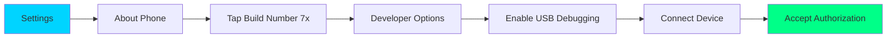

<div align="center">

<!-- Hero Banner -->


<br/>

<!-- Badges -->
<p align="center">
  <a href="https://github.com/0xb0rn3/droidB/releases">
    
  </a>
  <a href="https://github.com/0xb0rn3/droidB/blob/main/LICENSE">
    
  </a>
  <a href="https://github.com/0xb0rn3/droidB/stargazers">
    
  </a>
  <a href="https://github.com/0xb0rn3/droidB/network/members">
    
  </a>
</p>

<p align="center">
  <a href="https://github.com/0xb0rn3/droidB/issues">
    
  </a>
  <a href="https://www.shellcheck.net/">
    
  </a>
  <a href="#">
    
  </a>
  <a href="#-ethical-use--legal-notice">
    
  </a>
</p>

<!-- Animated Tagline -->
<h3>
  
</h3>

<br/>

<!-- Quick Links -->
<p align="center">
  <a href="#-highlights">
    
  </a>
  <a href="#-quick-start">
    
  </a>
  <a href="#-full-device-backup">
    
  </a>
  <a href="#-tinkerer-toolkit">
    
  </a>
  <a href="#-ethical-use--legal-notice">
    
  </a>
</p>

<br/>

<!-- Description -->
<p align="center">
  <b>The Ultimate Swiss Army Knife for Android Devices</b><br/>
  <i>Debloat • Flash • Backup • Manage • Optimize • Tinker</i>
</p>

</div>

---

<br/>

## ✨ Highlights

<table>
<tr>
<td width="50%" valign="top">

### 🗑️ **Universal Debloater**
```bash
300+ Bloatware Packages
├── One-Click Removal
├── Category Selection
├── Safe Restoration
└── Zero Root Required
```

**Remove unwanted apps instantly:**
- Amazon, Facebook, Google bloat
- Samsung services (Bixby, Knox, etc.)
- Carrier & OEM pre-installs
- Microsoft Office suite
- Social media & gaming apps

</td>
<td width="50%" valign="top">

### 📱 **Samsung Specialist**
```bash
Native Odin/Heimdall Support
├── Complete Firmware Flash
├── Download Mode Handling
├── PIT Operations
└── Bootloader Management
```

**Professional Samsung tooling:**
- BL/AP/CP/CSC flashing
- Stock firmware restoration
- Custom recovery installation
- Knox status checking

</td>
</tr>

<tr>
<td width="50%" valign="top">

### 💾 **Full Device Backup** *(v0.3.0)*
```bash
Pre-Flash Data Protection
├── SMS & MMS (adb + CSV fallback)
├── Contacts (vCard / DB)
├── Call Logs (CSV)
├── All Media (DCIM, Music, Docs…)
├── Installed APKs
└── Full ADB System Clone (.ab)
```

**Never lose data before a flash:**
- Auto-prompted before every destructive operation
- Timestamped backup folders with manifest
- Supports DCIM, WhatsApp, Telegram, Downloads and more
- One-click full backup or selective categories

</td>
<td width="50%" valign="top">

### 🔧 **Tinkerer Toolkit** *(v0.3.0)*
```bash
System App Push (Root Required)
├── /system/app & /system/priv-app
├── Auto Permission Grants
├── APK Signing (test-key / custom)
├── Signature Cloning from device
└── Magisk/KernelSU root grants
```

**For developers & power users:**
- Push custom APKs as trusted system apps
- Auto-detect & grant all declared permissions
- Clone signatures from existing system apps
- pk8 + pem keystore import pipeline
- privapp-permissions XML generation

</td>
</tr>

<tr>
<td width="50%" valign="top">

### ⚡ **ADB & Fastboot Master**
```bash
Complete Device Control
├── Drag & Drop Files
├── APK Management
├── System Operations
└── Backup & Restore
```

**Full automation suite:**
- Visual file explorer
- Screenshot/recording tools
- Logcat & debugging
- Wi-Fi ADB support

</td>
<td width="50%" valign="top">

### 🛡️ **Security-Focused**
```bash
Safe Operations
├── Multiple Confirmations
├── Pre-Flash Backup Prompts
├── Non-Destructive Mode
└── Rollback Support
```

**Built with safety in mind:**
- Mandatory backup check before every flash
- Pre-flight validation on destructive ops
- Progress indicators & error handling
- Recovery options at every step

</td>
</tr>
</table>

<br/>

<div align="center">

## 🎯 Why Choose droidB?

<table>
<tr>
<td align="center" width="25%">
<br/>
<b>Beginner Friendly</b><br/>
<sub>Menu-driven interface<br/>No commands to memorize</sub>
</td>
<td align="center" width="25%">
<br/>
<b>Lightning Fast</b><br/>
<sub>Optimized operations<br/>Batch processing</sub>
</td>
<td align="center" width="25%">
<br/>
<b>Production Ready</b><br/>
<sub>Tested on 50+ devices<br/>Active maintenance</sub>
</td>
<td align="center" width="25%">
<br/>
<b>Open Source</b><br/>
<sub>MIT licensed<br/>Community driven</sub>
</td>
</tr>
</table>

</div>

---

<br/>

## 🚀 Quick Start

<details open>
<summary><b>📱 Enable USB Debugging (First Time Users)</b></summary>

<br/>



**Step-by-Step:**
1. Open **Settings** → **About Phone**
2. Tap **Build Number** 7 times rapidly
3. Go back → **Developer Options**
4. Enable **USB Debugging**
5. Connect device via USB cable
6. Accept authorization prompt on device

</details>

<details open>
<summary><b>⚡ Installation & Launch</b></summary>

<br/>

### Option 1: System-Wide Install (Recommended)

```bash
# Clone repository
git clone https://github.com/0xb0rn3/droidB.git
cd droidB
chmod +x droidB

# Install globally
sudo ./droidB --install

# Run from anywhere
droidB
```

### Option 2: Portable Mode

```bash
git clone https://github.com/0xb0rn3/droidB.git
cd droidB && chmod +x droidB
./droidB
```

### Option 3: One-Liner

```bash
curl -fsSL https://raw.githubusercontent.com/0xb0rn3/droidB/main/droidB | sudo bash -s -- --install
```

</details>

<details>
<summary><b>🔧 Dependencies</b></summary>

<br/>

**Auto-installed by droidB, or install manually:**

| Platform | Command |
|----------|---------|
| **Ubuntu/Debian** | `sudo apt install android-tools-adb android-tools-fastboot` |
| **Arch Linux** | `sudo pacman -S android-tools` |
| **Fedora** | `sudo dnf install android-tools` |
| **macOS** | `brew install android-platform-tools` |
| **Windows** | Use WSL with Ubuntu commands |

**For Tinkerer Toolkit (optional, enables signing features):**

| Tool | Purpose | Install |
|------|---------|---------|
| `apksigner` | APK v1/v2/v3/v4 signing & cert inspection | `sudo apt install apksigner` |
| `keytool` | Keystore generation & management | `sudo apt install default-jdk` |
| `openssl` | pk8 → PEM conversion, cert extraction | `sudo apt install openssl` |
| `aapt` / `aapt2` | APK manifest inspection | `sudo apt install aapt` |

</details>

---

<br/>

## 💾 Full Device Backup

> **Available in Main Menu → Option 8**
> Automatically prompted before every flash or destructive operation.

droidB v0.3.0 introduces a comprehensive pre-flash backup system. Every destructive operation — firmware flashing, bootloader unlock, partition wipe — now presents a safety gate that requires you to either run a backup or explicitly acknowledge you already have one.

### What Gets Backed Up

| Category | Method | Output |
|----------|--------|--------|
| **SMS & MMS** | `adb backup` (telephony DB) → CSV content-provider fallback | `sms_mms.ab` / `sms_dump.csv` |
| **Contacts** | `adb backup` (contacts DB) → vCard stream fallback | `contacts.ab` / `contacts.vcf` |
| **Call Logs** | Content provider query | `call_logs.csv` |
| **Photos & Videos** | `adb pull` DCIM, Pictures, Movies | `media/DCIM/`, `media/Movies/` |
| **Music & Audio** | `adb pull` Music, Ringtones, Podcasts | `media/Music/` |
| **Documents** | `adb pull` Documents, Downloads | `media/Documents/` |
| **App Data** | WhatsApp, Telegram media folders | `media/WhatsApp/`, `media/Telegram/` |
| **APKs** | `pm path` + pull per package | `apks/<package>.apk` |
| **Full System Clone** | `adb backup -apk -shared -all -system` | `full_backup_<date>.ab` |

All backups are saved to `~/droidB_backups/<timestamp>_<serial>/` with a generated `BACKUP_MANIFEST.txt` containing device info, Android version, IMEI, file tree, and total backup size.

### Restore

```bash
# Restore a full .ab backup
adb restore ~/droidB_backups/<timestamp>/full_backup_<date>.ab

# Restore individual APK
adb install ~/droidB_backups/<timestamp>/apks/com.example.app.apk
```

---

<br/>

## 🔧 Tinkerer Toolkit

> **Available in App Management → Option 8**
> Requires root access (Magisk or KernelSU). For developers and power users working on their **own devices**.

### Push APK as System App

The system app push wizard walks through four sequential steps:

#### Step 1 — Target Directory

| Path | Use Case |
|------|----------|
| `/system/app` | Standard system app — no elevated permissions |
| `/system/priv-app` | Privileged app — PM-protected, signature-level trust |
| `/system/product/app` | Product partition (modern A/B devices) |
| Custom | Any path you specify |

#### Step 2 — Permission Profile

Grant Android permissions without any user prompt dialogs. Seven modes:

| Mode | What It Grants |
|------|---------------|
| None | Only permissions the APK already declared |
| Social Media preset | Location, Contacts, Camera, Microphone, Storage, Notifications |
| Full Dev/Root preset | All dangerous permission groups |
| Media preset | Camera, Microphone, Storage, Notifications |
| GRANT ALL | Every permission group (nuclear option) |
| Custom | Pick specific groups from a numbered list |
| **Auto-detect (default)** | Reads every `uses-permission` from the APK manifest and grants exactly those — nothing more, nothing less |

For `/system/priv-app` placements, a `privapp-permissions-<pkg>.xml` whitelist is automatically written to `/system/etc/permissions/` so the Android Package Manager never blocks privileged permissions regardless of API level.

#### Step 3 — APK Signing

| Option | Result |
|--------|--------|
| Skip | Use APK as-is |
| Auto test-key | Generates a persistent keystore at `~/.droidb/keystores/<pkg>/` — reused on every future push, so updates install without uninstall |
| Custom keystore | Bring your own `.jks` or `.keystore` file |
| Inspect platform key | Pulls `framework-res.apk`, dumps platform cert info for reference |
| **Clone from system app** | Full signature cloning workflow — see below |

#### Step 4 — Root Grant

Writes directly into the Magisk or KernelSU SQLite policy database by package UID. The app receives root silently on first launch — no popup required.

---

<br/>

## 🪞 Signature Cloning

> **Signing → Option 5: Clone signature from a system app**

One of droidB's most advanced tinkerer features. Pick any installed system app as a source, pull its APK, extract and analyze its X.509 certificate, and build a signing keystore that gives your custom app the same identity.

### How It Works

```
Device system APK ──adb pull──► Local analysis
        │
        ├── apksigner verify --print-certs
        ├── openssl pkcs7 (META-INF .RSA extraction)
        └── keytool -printcert -jarfile
                │
                ▼
        Certificate identity check
                │
        ┌───────┴────────────┐
        │                    │
  Known public key      OEM/unknown key
  (AOSP, LineageOS)     (Samsung, Google…)
        │                    │
        ▼                    ▼
  Full clone           Metadata only
  possible             (cert saved for
                        reference)
```

### Key Type Outcomes

| Key Type | What droidB Can Do |
|----------|--------------------|
| **AOSP Debug/Test Key** | Generate matching metadata keystore OR import exact private key from `testkey.pk8` + `testkey.x509.pem` |
| **AOSP Platform Key** | Same as above — key is in public AOSP source at `build/target/product/security/` |
| **LineageOS / CalyxOS / GrapheneOS** | Import exact pk8 + pem from ROM source tree, OR generate matching metadata keystore |
| **OEM Production Key** (Samsung, Google, etc.) | Save public cert for reference only. Private key lives in vendor HSM — cloning is technically impossible without vendor access |

### pk8 + pem Import Pipeline

If you have AOSP build tree access (you built the ROM yourself, or are using publicly committed AOSP test keys):

```
your_key.pk8 (DER)  ──openssl pkcs8──►  key.pem
your_key.x509.pem   ──openssl pkcs12──►  bundle.p12
                                              │
                                    keytool -importkeystore
                                              │
                                              ▼
                                    ~/.droidb/keystores/
                                    <pkg>/keystore.jks
                                              │
                                      apksigner sign
                                              │
                                              ▼
                                    Bit-for-bit identical
                                    signature as source app
```

This means the signed APK will be treated by Android as the **exact same signer** as the source system app — enabling `sharedUserId` sharing, `signatureOrSystem` permissions, and seamless update installs.

---

<br/>

## ⚖️ Ethical Use & Legal Notice

<div align="center">

> ### 🔴 READ THIS BEFORE USING THE TINKERER TOOLKIT
>
> **This section is not boilerplate. It is a binding condition of using this software.**

</div>

---

### Who This Tool Is For

droidB's advanced features — system app installation, permission bypass, signature cloning, root grants — were designed exclusively for:

- **Developers** testing their own applications on their own devices
- **Security researchers** performing authorized analysis on hardware they own or have explicit written permission to test
- **ROM tinkerers** customizing personal devices for personal use
- **IT administrators** managing a fleet of devices they are organizationally responsible for
- **Power users** reclaiming control of hardware they legally own

---

### What Is Explicitly Prohibited

Using droidB or any of its features to perform the following acts is **illegal** in most jurisdictions worldwide and is explicitly forbidden under the terms of this software's license:

#### 🚫 Unauthorized Device Access
Installing software, modifying system state, or extracting data from **any device you do not own** or do not have **explicit, documented, written permission** to modify. This includes:
- Devices belonging to partners, family members, employees, or anyone else
- Devices handed to you for repair, resale, or any other purpose
- Devices in shared spaces or public settings

This conduct constitutes unauthorized access under laws including but not limited to the **Computer Fraud and Abuse Act (CFAA, USA)**, **Computer Misuse Act (UK)**, **Cybercrime Convention (EU)**, and equivalent statutes in virtually every country.

#### 🚫 Stalkerware & Surveillance
Using the system app push, permission bypass, or silent root grant features to install tracking, monitoring, or surveillance software on a device without the owner's **explicit, informed, ongoing consent**. This includes:
- Location tracking without knowledge
- Silent camera or microphone access
- Covert SMS/call log monitoring
- Keyloggers or screen capture tools
- Any app whose primary purpose is to hide itself from the device owner

This is **stalkerware**. It is a form of intimate partner abuse and a criminal offense in most countries. droidB was not built to facilitate this. If you use it for this purpose, you are breaking the law and causing direct harm to a real person.

#### 🚫 Malware Distribution
Using the APK push or signing features to install malicious software, deploy ransomware, establish persistent backdoors, or conduct any other attack on a system you do not own.

#### 🚫 Signature Fraud
Using the signature cloning feature to impersonate a legitimate application publisher (Google, Samsung, a bank, a government service, etc.) for the purpose of deceiving users, bypassing security controls on systems you don't own, or committing fraud.

#### 🚫 Corporate Espionage & Data Theft
Using the backup or file extraction features to steal proprietary data, trade secrets, personal communications, or any data you are not authorized to access or retain.

---

### The Signature Cloning Feature — Specific Warning

The signature cloning system can produce APKs that carry the same signing identity as trusted system applications. This is a powerful capability with legitimate uses:

✅ **Legitimate:** Signing your own AOSP-based app with AOSP test keys for development  
✅ **Legitimate:** Re-signing a self-built ROM component with your own test infrastructure  
✅ **Legitimate:** Academic research into Android's trust model on hardware you own  

🚫 **Illegal:** Cloning the signature of a banking app to bypass fraud detection  
🚫 **Illegal:** Mimicking a Google Play system component to intercept data  
🚫 **Illegal:** Impersonating any app you did not create, on any device you do not own  

Android's signature verification exists to protect users. Circumventing it against someone else's device or data is a criminal act under computer fraud, identity fraud, and consumer protection statutes.

---

### The Permission Bypass Feature — Specific Warning

The auto-permission grant system installs an app and immediately grants it sensitive permissions (location, camera, microphone, contacts, SMS) without any user dialog. On **your own device, with your own app**, this is a perfectly valid development shortcut.

Used on **someone else's device** without their knowledge, this is the technical foundation of spyware. The permissions silently granted — precise location, microphone, camera — are exactly those used by stalkerware and commercial surveillance tools.

**If you are considering using this feature on a device that is not yours, stop. What you are planning is both a crime and an act of harm against another person.**

---

### No Warranty / Liability

```
THE SOFTWARE IS PROVIDED "AS IS", WITHOUT WARRANTY OF ANY KIND,
EXPRESS OR IMPLIED. IN NO EVENT SHALL THE AUTHORS OR COPYRIGHT
HOLDERS BE LIABLE FOR ANY CLAIM, DAMAGES, OR OTHER LIABILITY —
INCLUDING BRICKED DEVICES, DATA LOSS, VOIDED WARRANTIES,
CARRIER BANS, OR ANY LEGAL CONSEQUENCES RESULTING FROM MISUSE.

YOU, THE USER, ACCEPT FULL AND SOLE RESPONSIBILITY FOR:
  • Every operation you perform with this tool
  • Every device you connect it to
  • Every APK you install through it
  • Every permission you grant through it
  • Every action taken under any signature you create with it

IGNORANCE OF THE LAW IS NOT A DEFENCE.
CLAIMING YOU DID NOT READ THIS DISCLAIMER IS NOT A DEFENCE.
```

---

### Reporting Misuse

If you discover droidB is being used against you or against a device you own without your consent, the following resources may help:

- **National Domestic Violence Hotline (USA):** 1-800-799-7233
- **Coalition Against Stalkerware:** https://stopstalkerware.org
- **Cyber Civil Rights Initiative:** https://cybercivilrights.org
- **Your local law enforcement** — this constitutes criminal computer access in most jurisdictions

---

<br/>

## 🗑️ Universal Debloater

<div align="center">

### **Remove 300+ Bloatware Packages in Seconds**


</div>

**Supported categories:**
- Amazon suite (Kindle, MP3, Alexa, AppStore)
- Facebook family (Instagram, WhatsApp system components)
- Google bloat (Bard, Google TV, unnecessary sync adapters)
- Samsung services (Bixby, Galaxy Store redundancies, Knox enrollment)
- Microsoft Office suite
- Carrier pre-installs
- OEM gaming & lifestyle apps

All removals use `pm disable-user --user 0` by default (non-destructive, reversible). Hard uninstall is available as a secondary option with an additional confirmation step.

---

<br/>

## 📱 Screenshots

<div align="center">

### **See droidB in Action**

<table>
<tr>
<td align="center" width="33%">
<br/>
<b>Main Interface</b><br/>
<sub>Intuitive menu system</sub>
</td>
<td align="center" width="33%">
<br/>
<b>Universal Debloater</b><br/>
<sub>One-click bloatware removal</sub>
</td>
<td align="center" width="33%">
<br/>
<b>Samsung Operations</b><br/>
<sub>Professional firmware tools</sub>
</td>
</tr>
<tr>
<td align="center" width="33%">
<br/>
<b>Full Device Backup</b><br/>
<sub>Pre-flash data protection</sub>
</td>
<td align="center" width="33%">
<br/>
<b>Tinkerer Toolkit</b><br/>
<sub>System app installation</sub>
</td>
<td align="center" width="33%">
<br/>
<b>Signature Cloning</b><br/>
<sub>APK identity management</sub>
</td>
</tr>
</table>

</div>

---

<br/>

## ⚡ Quick Reference Card

<div align="center">

**Bookmark this for instant access!**

</div>

```
╔══════════════════════════════════════════════════════════════════════════╗
║                      droidB v0.3.0 QUICK REFERENCE                       ║
╠══════════════════════════════════════════════════════════════════════════╣
║                                                                          ║
║  🗑️  DEBLOATER                    📱 SAMSUNG                            ║
║  ├─ One-Click Debloat             ├─ Flash Firmware (Odin4)             ║
║  ├─ Selective Removal             ├─ Download Mode                      ║
║  ├─ Scan Device                   ├─ PIT Operations                     ║
║  └─ Restore Apps                  └─ Recovery Flash                     ║
║                                                                          ║
║  📂 FILES                         ⚙️  SYSTEM                            ║
║  ├─ Push/Pull Files               ├─ Reboot Modes                       ║
║  ├─ Screenshot                    ├─ Battery Info                       ║
║  ├─ Screen Record                 ├─ Live Logcat                        ║
║  └─ File Explorer                 └─ Properties                         ║
║                                                                          ║
║  📦 APPS                          ⚡ FASTBOOT                            ║
║  ├─ Install APK                   ├─ Flash Partitions                   ║
║  ├─ Uninstall                     ├─ Unlock/Lock BL                     ║
║  ├─ Clear Data / Force Stop       ├─ Boot Image                         ║
║  └─ 🔧 Push as System App         └─ GSI Flash                          ║
║                                                                          ║
║  💾 FULL BACKUP                   🪞 TINKERER                           ║
║  ├─ SMS / MMS                     ├─ Permission Profiles                ║
║  ├─ Contacts / Call Logs          ├─ APK Signing                        ║
║  ├─ All Media & Docs              ├─ Signature Cloning                  ║
║  ├─ APK Archive                   ├─ pk8 + pem Import                   ║
║  └─ Full .ab System Clone         └─ Magisk/KSU Root Grant              ║
║                                                                          ║
╠══════════════════════════════════════════════════════════════════════════╣
║  SHORTCUTS                                                               ║
║  • Launch: droidB                 • Help:    droidB --help               ║
║  • Install: sudo droidB --install • Version: droidB --version            ║
╠══════════════════════════════════════════════════════════════════════════╣
║  ⚖️  USE ON YOUR OWN DEVICES ONLY. SEE ETHICAL USE POLICY.              ║
╚══════════════════════════════════════════════════════════════════════════╝
```

---

<br/>

## 📊 Project Stats

<div align="center">


<br/><br/>


</div>

---

<br/>

<div align="center">

**Vote on features in [Discussions](https://github.com/0xb0rn3/droidB/discussions)!**

</div>

---

<br/>

<div align="center">

## 💝 Support the Project

**If droidB saved your data, cleaned your device, or powered your tinkering — consider supporting development!**

<br/>

<a href="https://github.com/sponsors/0xb0rn3">

</a>
<a href="#">

</a>

<br/><br/>

**Other ways to support:**
- ⭐ Star this repository
- 🐛 Report bugs and issues
- 📝 Improve documentation
- 💻 Contribute code
- 📢 Share with others
- 💬 Help in discussions

</div>

---

<br/>

<div align="center">

## 👨‍💻 About the Developer


**0xbv1 | 0xb0rn3**

Security Researcher • Android Enthusiast • Open Source Advocate

<br/>

[](https://github.com/0xb0rn3)
[](https://twitter.com/0xb0rn3)
[](mailto:contact@example.com)

<br/>

*"Building tools that empower users to take control of their devices — not control of other people's."*

</div>

---

<br/>

<div align="center">

## 📜 Full Disclaimer

> **⚠️ USE AT YOUR OWN RISK — ON YOUR OWN DEVICES**
>
> This tool installs system applications, modifies firmware, grants elevated permissions, clones APK signatures, and interfaces with device security mechanisms. These are powerful capabilities. They can brick devices, void warranties, trigger carrier locks, expose sensitive data, and — if misused — constitute criminal offences.
>
> The developer is not responsible for:
> - Bricked, bootlooped, or otherwise damaged devices
> - Data loss resulting from any operation performed with this tool
> - Voided manufacturer or carrier warranties
> - Legal consequences arising from misuse
> - Any harm caused to any person by software installed using this tool
>
> **Before every flash or system-level operation, verify:**
> - You own the device or have explicit written authorization to modify it
> - Your device is charged above 50%
> - You have completed a full backup (droidB will remind you)
> - You understand exactly what the operation will do
> - You have read and understood the [Ethical Use & Legal Notice](#-ethical-use--legal-notice)
>
> **By downloading, installing, or running droidB you confirm:**
> You have read the Ethical Use Policy in full. You will only use this software on devices you own or are explicitly authorized to modify. You accept sole and complete legal and moral responsibility for every action taken with this tool.

</div>

---

<br/>

<div align="center">

## 🎉 Thank You!

**Made with ❤️ for the Android community — and the tinkerers who make it what it is**

<br/>


<br/>

**Star ⭐ this repo if droidB helped you!**

[](https://github.com/0xb0rn3/droidB/stargazers)
[](https://github.com/0xb0rn3/droidB/network/members)
[](https://github.com/0xb0rn3/droidB/watchers)

<br/>

[⬆ Back to Top](#)

---

<sub>Last Updated: February 2026 • Version 0.3.0 • © 2024–2026 0xb0rn3 • <a href="#-ethical-use--legal-notice">Ethical Use Policy</a></sub>

</div>
